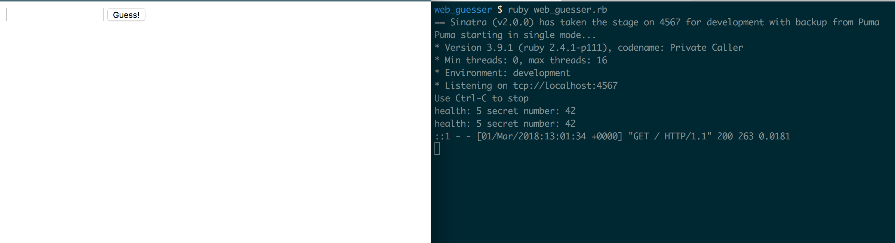
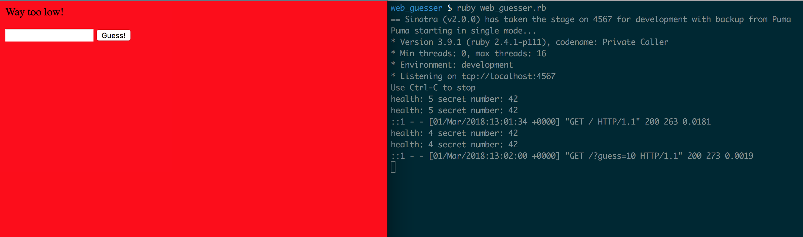
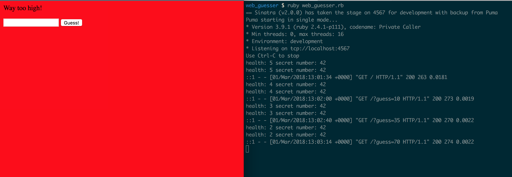
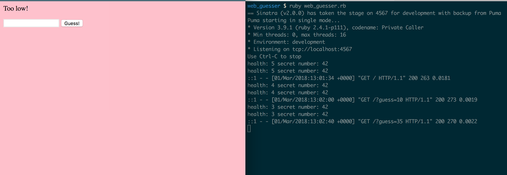
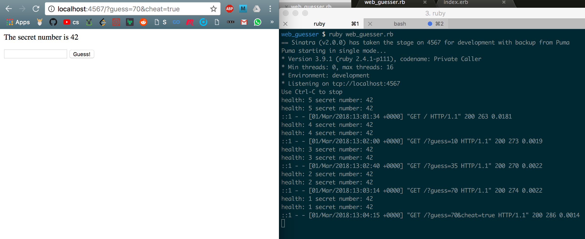
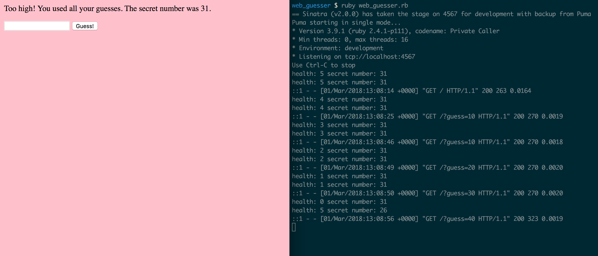
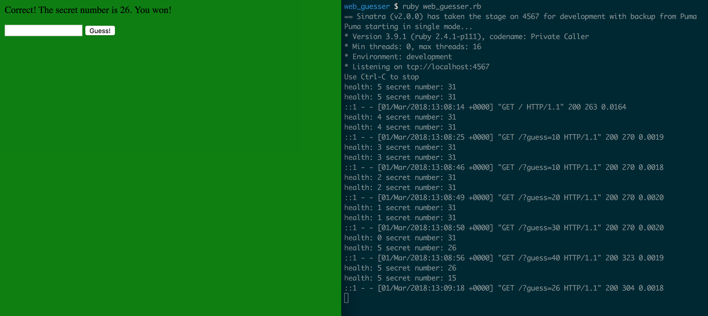

I followed this project from [here](http://tutorials.jumpstartlab.com/projects/web_guesser.html)

### Before start

### If the guess is way too low or way too high.

### If the guess is too low.

### If cheat_mode is `true`

No colour but health is decreasing

### If the guesses are all used

Program chooses new secret_number, and resets health to 5 again.

### If there is a winner

Program chooses new secret_number, and resets health to 5 again.

